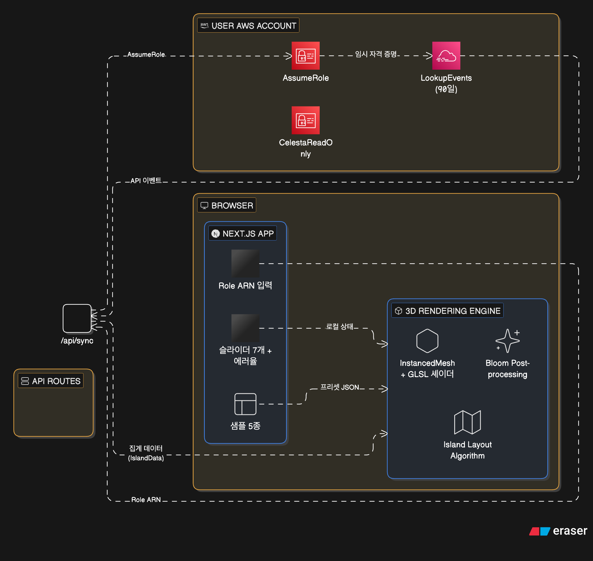

# Cloud Island (Celesta)

AWS CloudTrail 로그를 3D 복셀 구름 섬으로 시각화하는 웹 플랫폼.


---

## 팀 정보

- **팀명** : Stelloud
- **기여자** : 고동현, 이민형
- **역할 분담** :
    - 고동현 : 아이디어, AWS CloudTrail 로그 파싱
    - 이민형 : 이벤트 기반 파티클 트리거

---

## 서비스 개요

[Git City](http://thegitcity.com/)를 벤치마크한 프로젝트로, GitHub 커밋 활동을 3D 빌딩으로 시각화하는 Git City의 컨셉을 AWS 인프라에 적용했습니다. AWS CloudTrail 로그를 수집·집계하여 계정의 API 활동을 3D 복셀 구름 섬(라퓨타 스타일)으로 시각화하는 웹 플랫폼입니다. API 호출 수는 구름 두께로, 리소스 수는 구름 면적으로, 에러율은 빨간 파티클과 파손 블록으로 매핑되며, AWS 공식 카테고리 색상 7개를 사용해 서비스 종류를 직관적으로 구분합니다.

> 현재 우주 컨셉으로 변경도 고려중 입니다.

| 색상 | 카테고리 | 대표 서비스 |
|------|---------|-----------|
| 🟠 `#ED7100` | Compute | EC2, Lambda, ECS |
| 🟢 `#7AA116` | Storage | S3, EBS, EFS |
| 🟣 `#8C4FFF` | Networking | VPC, CloudFront, API Gateway |
| 🔴 `#DD344C` | Security | IAM, GuardDuty, WAF |
| 🩷 `#E7157B` | Management | CloudWatch, SNS, SQS |
| 🔵 `#3334B9` | Database | RDS, DynamoDB, Aurora |
| 🩵 `#01A88D` | AI/ML | SageMaker, Bedrock |

---

## 서비스 시스템 아키텍처



**기술 스택**: Next.js 16, React 19, TypeScript, Three.js + R3F, Tailwind CSS v4, AWS SDK (CloudTrail, STS)

---

## 시작하기

```bash
npm install
npm run dev
```

http://localhost:3000 에서 확인.

## 프로젝트 구조

```
src/
├── app/
│   ├── page.tsx                       # 메인 (3탭 UI)
│   ├── api/island/route.ts            # 섬 데이터 API (mock)
│   └── api/sync/route.ts              # CloudTrail 동기화
├── components/
│   ├── IslandCanvas.tsx               # R3F Canvas + Sky + Bloom + Controls
│   ├── IslandScene.tsx                # 단일 섬 씬
│   ├── IslandBase.tsx                 # 라퓨타 스타일 플로팅 베이스
│   ├── InstancedVoxels.tsx            # 복셀 인스턴스 렌더링 + GLSL 셰이더
│   ├── IslandCategoryEffects.tsx      # 카테고리별 환경 이펙트 (번개/비/눈 등)
│   ├── IslandDamageEffects.tsx        # 에러 기반 파손 블록
│   ├── BalloonExplorerCanvas.tsx      # 풍선 탐험 모드
│   ├── FallingParticles.tsx           # 범용 파티클 시스템
│   ├── ErrorParticles.tsx             # 에러 파티클
│   ├── CategoryLabels.tsx             # 카테고리 구역 라벨
│   ├── CategoryLegend.tsx             # 색상 범례
│   ├── CategoryDetailPanel.tsx        # 카테고리 상세 패널
│   ├── SimulatorPanel.tsx             # 슬라이더 시뮬레이터
│   ├── PresetSelector.tsx             # 프리셋 선택
│   ├── AccountInput.tsx               # AWS 계정 입력
│   └── LoadingScreen.tsx              # 로딩 화면
├── lib/
│   ├── cloud-island.ts                # 타입 정의
│   ├── island-layout.ts               # 섬 레이아웃 알고리즘
│   ├── aws-categories.ts              # 7개 카테고리 정의
│   └── mock-data.ts                   # 모의 데이터 + 프리셋 5종
```

## 커맨드

```bash
npm run dev      # 개발 서버 (Turbopack)
npm run build    # 프로덕션 빌드
npm run lint     # ESLint
```
