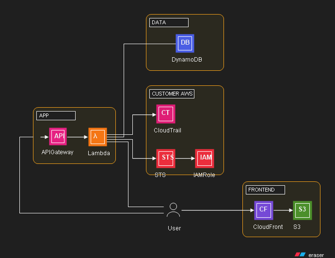

# Cloud Island

AWS CloudTrail 활동 로그를 3D 클라우드 행성과 우주 탐험 인터페이스로 시각화하는 서비스입니다.

- 배포 URL: https://d3lxec0zrny29n.cloudfront.net/
- 기술 스택: Next.js 16, React 19, TypeScript, Three.js, React Three Fiber, Tailwind CSS v4, AWS SDK v3, Terraform
- 배포 구조: S3 정적 호스팅, CloudFront CDN, API Gateway, Lambda, DynamoDB

## Problem 정의

AWS 계정의 인프라 활동은 CloudTrail에 자세히 기록되지만, 일반적인 로그 테이블이나 콘솔 화면만으로는 전체 사용 패턴을 직관적으로 파악하기 어렵습니다. 어떤 서비스 카테고리가 많이 쓰이는지, 에러가 어디에 집중되는지, 여러 계정 또는 팀의 활동량 차이가 어떤지 한눈에 비교하기 힘듭니다.

Cloud Island는 CloudTrail 이벤트를 서비스 카테고리별로 집계하고, 이를 3D 공간의 행성, 궤도, 색상, 이펙트로 변환합니다. 사용자는 숫자 중심 로그를 직접 뒤지는 대신, AWS 계정의 활동 상태를 시각적으로 탐색할 수 있습니다.

## 서비스 개요

Cloud Island는 AWS 인프라 활동을 “행성”으로 표현합니다. 각 행성은 하나의 AWS 계정 또는 프리셋 환경을 나타내고, 행성의 크기와 구성은 API 호출량, 에러 수, 서비스 카테고리 분포에 따라 달라집니다.

현재 공개 배포 버전은 다음 흐름을 제공합니다.

- 기본 프리셋 행성 5종: 스타트업, 데이터팀, ML팀, 엔터프라이즈, 보안팀
- 7개 AWS 서비스 카테고리: Compute, Storage, Database, Networking, Security, Management, AI/ML
- `Simulator`: 카테고리별 활동량과 에러율을 조정해 즉시 3D 결과 확인
- `Connect AWS`: AWS Role ARN을 입력해 실제 CloudTrail 기반 데이터 동기화
- `Space Explore`: 사용자가 우주 공간을 직접 비행하며 행성을 탐색
- `Leaderboard`: 전체 행성을 총 API 호출량 기준으로 정렬

공개 페이지의 기본 카테고리 활동량은 다음과 같습니다.

| 카테고리 | 기본 활동량 |
| --- | ---: |
| Compute | 12.0k |
| Storage | 8.0k |
| Database | 3.0k |
| Networking | 2.0k |
| Security | 4.0k |
| Management | 1.5k |
| AI/ML | 1.2k |

## 아키텍처 설계



Cloud Island는 정적 프론트엔드와 서버리스 백엔드로 구성됩니다. 사용자는 CloudFront를 통해 S3에 배포된 프론트엔드에 접속하고, 앱은 API Gateway와 Lambda를 통해 데이터 동기화 요청을 처리합니다.

- `APP`: API Gateway가 프론트엔드 요청을 받고 Lambda로 전달합니다.
- `DATA`: Lambda는 DynamoDB에 동기화된 행성 스냅샷과 플레이어 상태를 저장합니다.
- `CUSTOMER AWS`: Lambda는 STS로 고객 AWS 계정의 IAM Role을 AssumeRole하고 CloudTrail 이벤트를 조회합니다.
- `FRONTEND`: CloudFront가 S3에 저장된 정적 프론트엔드 파일을 사용자에게 제공합니다.
- `User`: 사용자는 프론트엔드에 접속하고, Connect AWS 흐름에서 Role ARN을 입력해 실제 AWS 활동 데이터를 동기화합니다.

핵심 API는 다음과 같습니다.

| 경로 | 역할 |
| --- | --- |
| `POST /sync` | Role ARN 기반 CloudTrail 동기화 및 스냅샷 저장 |
| `GET /island?accountId=...` | 특정 AWS 계정의 최신 행성 데이터 조회 |
| `GET /islands` | 저장된 행성 목록 조회 |
| `GET /players` | 현재 활성화된 Space Explore 플레이어 조회 |
| `POST /players` | 플레이어 위치와 상태 업데이트 |

## 주요 기능 설명

### 1. CloudTrail 기반 시각화

AWS Role ARN을 입력하면 백엔드가 해당 역할을 AssumeRole하고 최근 CloudTrail 이벤트를 조회합니다. 이벤트 소스는 Compute, Storage, Database, Networking, Security, Management, AI/ML 카테고리로 분류되며, API 호출량과 에러 수에 따라 3D 행성의 형태와 이펙트가 달라집니다.

### 2. 3D 클라우드 행성 렌더링

Three.js와 React Three Fiber를 사용해 여러 행성을 하나의 우주 공간에 배치합니다. 행성은 활동량 기준으로 배치되고, 선택한 행성의 상세 정보와 카테고리별 활동 내역을 패널에서 확인할 수 있습니다.

### 3. Simulator

실제 AWS 연결 없이도 카테고리별 API 호출량과 에러율을 조정해 행성이 어떻게 변하는지 확인할 수 있습니다. 데모, 발표, 테스트 환경에서 빠르게 서비스 컨셉을 보여주기 위한 기능입니다.

### 4. Space Explore

`Space Explore` 모드에서는 사용자가 3D 공간을 직접 비행하며 행성을 탐색합니다. WASD, 방향키, Space/E, Shift/Q 조작을 통해 행성 사이를 이동할 수 있고, 다른 활성 플레이어의 위치도 공유됩니다.

### 5. 저장된 행성과 리더보드

성공적으로 동기화된 AWS 계정은 DynamoDB에 최신 스냅샷으로 저장됩니다. 프론트엔드는 저장된 행성을 불러와 우주 공간에 추가하고, 총 API 호출량 기준으로 상위 행성을 리더보드에 표시합니다.

## 실행 방법

```bash
npm install
npm run dev
```

로컬에서는 http://localhost:3000 에서 확인할 수 있습니다.

## 배포 방법

```bash
npm run build:deploy
cd aws
terraform init
terraform plan
terraform apply
```

자세한 배포 절차는 `docs/deployment.md`를 참고하세요.
