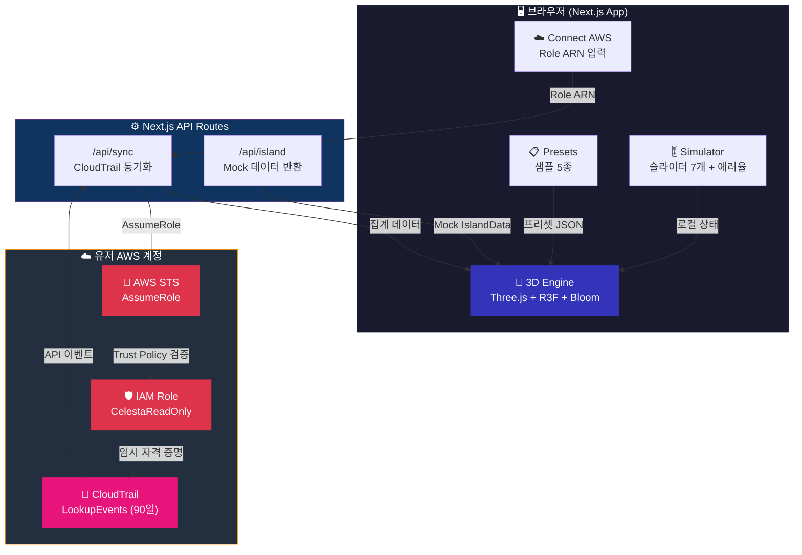

# Cloud Island — 서버 아키텍처

## 현재 구현 (Phase 1-2)



---

## 서버 아키텍처 (Phase 3-5)

```mermaid
graph TB
    subgraph Client["🖥️ 브라우저"]
        Browser["Next.js Frontend<br/>Landing · Simulator · Presets<br/>Dashboard · 군도 뷰"]
        Engine["🔷 3D Engine<br/>Three.js + R3F + Bloom + Sky"]
    end

    subgraph Hosting["▲ Vercel"]
        Serverless["Serverless Functions"]
        CDN["Edge Network (CDN)"]
        Cron["⏰ Cron Job<br/>6시간 자동 동기화"]
    end

    subgraph API["⚙️ Next.js API Routes"]
        Auth["/api/auth<br/>GitHub OAuth 콜백"]
        Connect["/api/connect<br/>Role ARN 등록"]
        Sync["/api/sync<br/>CloudTrail 동기화 + 집계"]
        Island["/api/island<br/>단일 섬 데이터"]
        Islands["/api/islands<br/>군도 목록"]
        MW["🛡️ Middleware<br/>인증 + Rate Limit"]
    end

    subgraph Supabase["🟢 Supabase"]
        SBAuth["👤 Auth<br/>GitHub OAuth"]
        subgraph DB["PostgreSQL"]
            users["users"]
            aws_conn["aws_connections<br/>Role ARN + status"]
            island_data["island_data<br/>카테고리별 집계"]
            sync_hist["sync_history<br/>동기화 이력"]
        end
    end

    subgraph UserAWS["☁️ 유저 AWS 계정"]
        CFn["📦 CloudFormation<br/>원클릭 스택 배포"]
        IAM["🛡️ IAM Role<br/>CelestaReadOnly<br/>비용 $0"]
        STS["🔑 STS<br/>AssumeRole"]
        CT["📜 CloudTrail<br/>LookupEvents<br/>90일 무료"]
    end

    subgraph ServiceAWS["☁️ Celesta 서비스 계정"]
        S3["📁 S3<br/>role.yaml 템플릿"]
    end

    %% 인증 흐름
    Browser -->|"GitHub 로그인"| Auth
    Auth <-->|"OAuth 토큰 / 세션 JWT"| SBAuth

    %% AWS 연결 흐름
    Browser -->|"QuickCreate URL"| CFn
    S3 -->|"role.yaml"| CFn
    CFn -->|"Role 생성"| IAM
    Browser -->|"Role ARN 등록"| Connect
    Connect -->|"ARN + ExternalId 저장"| aws_conn

    %% 동기화 흐름
    Cron -->|"6시간마다"| Sync
    Browser -->|"수동 Sync"| Sync
    Sync -->|"AssumeRole"| STS
    STS -->|"Trust Policy 검증"| IAM
    Sync -->|"LookupEvents"| CT
    CT -->|"이벤트 원본 (메모리)"| Sync
    Sync -->|"집계 숫자만 저장"| island_data

    %% 조회 & 렌더링
    Browser -->|"내 섬 요청"| Island
    Browser -->|"군도 목록"| Islands
    Island -->|"쿼리"| island_data
    Islands -->|"공개 섬 조회"| island_data
    Island -->|"IslandData JSON"| Engine
    Islands -->|"ArchipelagoData JSON"| Engine

    %% 호스팅
    Serverless -.->|"호스팅"| API

    style Client fill:#1a1a2e,stroke:#16213e,color:#fff
    style Hosting fill:#111,stroke:#fff,color:#fff
    style API fill:#0f3460,stroke:#533483,color:#fff
    style Supabase fill:#1a3a2e,stroke:#3ECF8E,color:#fff
    style DB fill:#1a3a2e,stroke:#3ECF8E,color:#fff
    style UserAWS fill:#232F3E,stroke:#FF9900,color:#fff
    style ServiceAWS fill:#232F3E,stroke:#8C4FFF,color:#fff
    style STS fill:#DD344C,stroke:#DD344C,color:#fff
    style IAM fill:#DD344C,stroke:#DD344C,color:#fff
    style CT fill:#E7157B,stroke:#E7157B,color:#fff
    style CFn fill:#E7157B,stroke:#E7157B,color:#fff
    style S3 fill:#7AA116,stroke:#7AA116,color:#fff
    style Engine fill:#3334B9,stroke:#3334B9,color:#fff
    style SBAuth fill:#3ECF8E,stroke:#3ECF8E,color:#000
```



---

## 데이터 흐름 요약

```
Phase 1-2 (현재)                          Phase 3-5 (목표)
─────────────────                         ─────────────────
슬라이더/프리셋 ─► 3D 렌더링              GitHub OAuth ─► Supabase Auth
                                                │
Role ARN 입력 ─► /api/sync                      ▼
       │                                  CloudFormation 원클릭
       ▼                                        │
  STS AssumeRole                                 ▼
       │                                  Role ARN ─► /api/connect ─► DB 저장
       ▼                                        │
  CloudTrail LookupEvents                       ▼
       │                                  Cron (6h) ─► /api/sync
       ▼                                        │
  메모리 집계 ─► 3D 렌더링                       ▼
                                          STS ─► CloudTrail ─► 집계 ─► DB
                                                │
                                                ▼
                                          /api/island ─► 3D 렌더링
                                          /api/islands ─► 군도 뷰
```

---

## Phase별 구현 범위

| Phase | 범위 | 핵심 추가 |
|-------|------|----------|
| **1-2 (완료)** | 프론트엔드 데모 | 3D 엔진, 시뮬레이터, 프리셋, /api/sync 스켈레톤 |
| **3** | AWS 실제 연결 | CloudFormation 템플릿, /api/connect, Supabase DB |
| **4** | 멀티유저 | GitHub OAuth, 군도 뷰, 공개 설정, /island/[userId] |
| **5** | 자동화 | Cron 동기화, 히스토리 스냅샷, EventBridge 실시간 |
